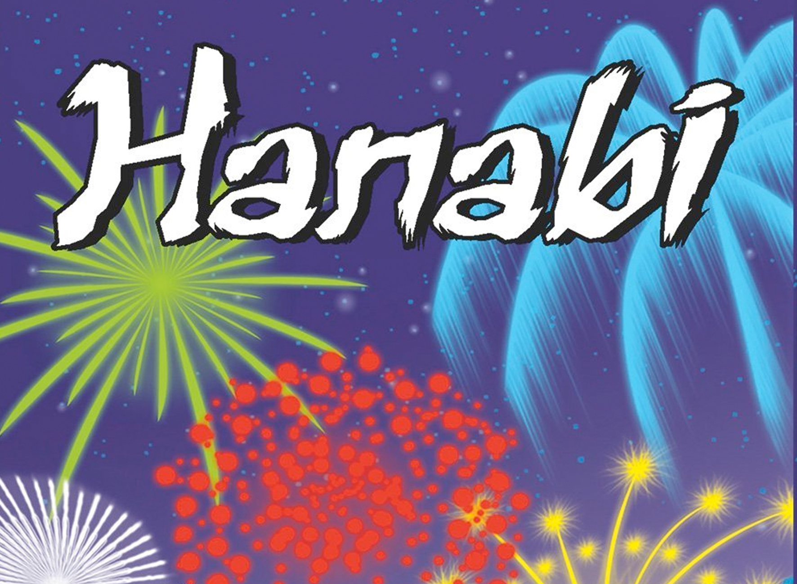

# Predicting Pyrotechnics
## Hanabi score prediction with ML

## Repository Link

[https://github.com/your_username/your_project_name]

## Description

We want to take a closer look at "Hanabi", a cooperative card game where the catch is that you can't see your own hand and instead only see your teammates cards. Success depends on how well the team communicates through limited hints - or maybe how lucky the first cards are? For this project, we want to explore about 2000 of real-world game logs. Our idea is to use regression to predict the final score based on the first cards each player gets. 

### Task Type

Regression

### Results Summary

#### Best Model Performance
- **Best Model:** [Name and type of the best-performing model"]
- **Evaluation Metric:** [Primary metric used, e.g., Accuracy, F1-Score, MSE, MAE]
- **Final Performance:** [Best score achieved, e.g., 95% accuracy, F1-score of 0.87, MSE of 0.12]

#### Model Comparison
- **Baseline Performance:** [Baseline model performance for comparison]
- **Improvement Over Baseline:** [Quantitative improvement, e.g., "+12% accuracy", "25% reduction in MSE"]
- **Best Alternative Model:** [Second-best model and its performance]

#### Key Insights
- **Most Important Features:** [Top 3-5 features that drive model performance]
- **Model Strengths:** [What the model does well]
- **Model Limitations:** [Known limitations and failure cases]
- **Business Impact:** [Practical implications of the model performance]

## Documentation

1. **[Literature Review](0_LiteratureReview/README.md)**
2. **[Dataset Characteristics](1_DatasetCharacteristics/exploratory_data_analysis.ipynb)**
3. **[Baseline Model](2_BaselineModel/baseline_model.ipynb)**
4. **[Model Definition and Evaluation](3_Model/model_definition_evaluation)**
5. **[Presentation](4_Presentation/README.md)**

## Cover Image

